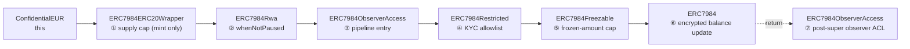
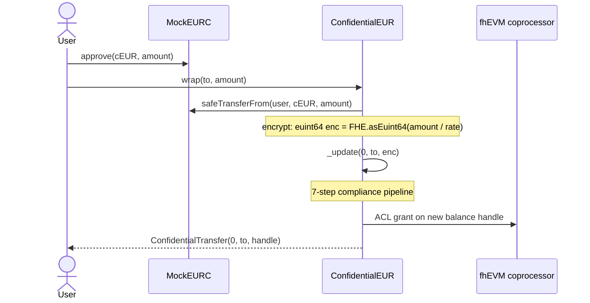
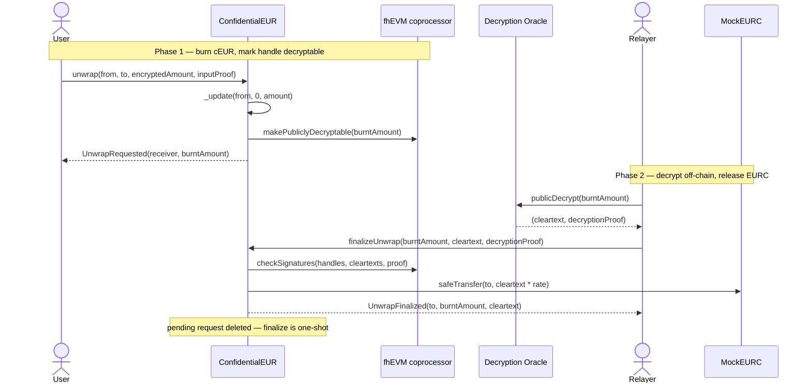

# Architecture

This document explains how `ConfidentialEUR` (cEUR) is put together: the
component layout, the inheritance-driven compliance pipeline, and the two
user-facing flows (`wrap` and `unwrap`).

---

## Components

| Component              | Role                                                                                                                                                | Lives in     |
| ---------------------- | --------------------------------------------------------------------------------------------------------------------------------------------------- | ------------ |
| `ConfidentialEUR.sol`  | The cEUR token contract. Lock-and-mint wrapper around EURC plus a built-in compliance layer.                                                        | `contracts/` |
| `MockEURC.sol`         | Local stand-in for Circle's EURC. Used on the Hardhat network only; on Sepolia the real EURC contract is used.                                      | `contracts/` |
| Zama fhEVM coprocessor | Performs all homomorphic operations (`add`, `sub`, `select`) on encrypted state. Runs alongside the EVM and is invoked through the `FHE` library.   | external     |
| Decryption oracle      | Produces cleartext + proof for any handle marked as publicly decryptable. Used by `finalizeUnwrap` to learn the burnt amount before releasing EURC. | external     |

All compliance and confidential-token logic comes from OpenZeppelin's `confidential-contracts` library;
this PoC is mostly about **how those pieces are composed and configured**.

---

## Inheritance and the compliance pipeline

`ConfidentialEUR` mixes three direct parents:

```solidity
contract ConfidentialEUR is ERC7984ObserverAccess, ERC7984Rwa, ERC7984ERC20Wrapper { … }
```

Solidity's C3 linearisation turns these three mixins into a single deterministic
order. Every `super._update()` call walks that order from most-derived to
most-base, executing each layer's pre-`super` logic on the way down and any
post-`super` logic on the way back up.



Walked top-to-bottom on every mint, burn, transfer, wrap and unwrap:

| #   | Layer                   | Behaviour                                                                                                                                   |
| --- | ----------------------- | ------------------------------------------------------------------------------------------------------------------------------------------- |
| 1   | `ERC7984ERC20Wrapper`   | Reverts if a mint would push `inferredTotalSupply()` past `maxTotalSupply()` (`uint64.max`). Other operations pass through.                 |
| 2   | `ERC7984Rwa`            | Enforces `whenNotPaused`. Hard revert.                                                                                                      |
| 3   | `ERC7984ObserverAccess` | Pipeline entry; combined with step 7 below.                                                                                                 |
| 4   | `ERC7984Restricted`     | Reverts if `from` or `to` is not in `Restriction.ALLOWED`. KYC gate.                                                                        |
| 5   | `ERC7984Freezable`      | Caps the transfer at the unfrozen portion of the sender's balance. **Silent failure**: an over-cap transfer ends up moving zero, no revert. |
| 6   | `ERC7984`               | Updates the encrypted balances, emits `ConfidentialTransfer`, grants ACL on the new ciphertext.                                             |
| 7   | `ERC7984ObserverAccess` | Post-`super` step that grants observer ACL on the resulting balance ciphertext.                                                             |

The current order is verified by compilation and the full test suite.

`ConfidentialEUR._update()` is a single `super._update(...)` call. That one line
is the contract's entire transfer-security surface — see
[`ConfidentialEUR.sol:128-138`](../contracts/ConfidentialEUR.sol).

---

## Wrap flow

`wrap()` moves EURC into the contract and credits encrypted cEUR to a recipient
account. Synchronous: the input is a plaintext `uint256` amount, the contract
encrypts it before storing.



Notes:

- `rate()` is 1 in this PoC: cEUR and EURC share six decimals, so 1 EURC ≡ 1 cEUR.
- KYC is enforced at step 4 of the pipeline. A user without `Restriction.ALLOWED`
  cannot wrap, even if EURC `approve` succeeded.
- The supply-cap check (step 1) only fires on mint paths, of which `wrap` is one.

---

## Unwrap flow (two-phase)

Unwrap is asynchronous. The contract burns the encrypted cEUR balance
immediately, but it cannot release the underlying EURC until the burnt amount
has been **publicly decrypted off-chain** and the cleartext returned together
with a proof.



Notes:

- `_unwrapRequests[burntAmount]` is deleted on finalize, so a second
  `finalizeUnwrap` call with the same handle reverts with `InvalidUnwrapRequest`
  (covered by the `double finalizeUnwrap reverts` test).
- Phase 1's `_update(from, 0, ...)` runs the same 7-step pipeline as a transfer —
  KYC on `from` is enforced. A user whose KYC was revoked between wrap and unwrap
  cannot unwrap.

---

## Coverage invariant

cEUR must be backed 1:1 by EURC locked in the contract. Two mechanisms enforce
this:

1. **Direct mint and burn are disabled.** All four overloads of
   `confidentialMint` and `confidentialBurn` revert with `DirectMintDisabled` /
   `DirectBurnDisabled`. The only paths that change supply are `wrap` (mint
   against EURC pulled in) and `unwrap` + `finalizeUnwrap` (burn cEUR, release
   EURC).
2. **`inferredTotalSupply()` is publicly auditable.** The wrapper exposes
   `underlying().balanceOf(address(this)) / rate()` as a non-confidential view
   function. Together with disabled direct mint/burn, this gives a public
   upper bound on the confidential total supply at any block.

The wrap/unwrap test (`maintains the coverage invariant after wrap`) documents
this property explicitly via `inferredTotalSupply() == locked EURC` (since
`rate() == 1`).

---

## Roles

| Role                 | Granted by                                               | Capabilities                                                                                                       |
| -------------------- | -------------------------------------------------------- | ------------------------------------------------------------------------------------------------------------------ |
| `DEFAULT_ADMIN_ROLE` | Constructor                                              | Grants and revokes `AGENT_ROLE`.                                                                                   |
| `AGENT_ROLE`         | Admin                                                    | KYC operations (`approveUser`, `revokeUser`, `blockUser`, `unblockUser`), freeze, force-transfer, pause / unpause. |
| User (KYC-approved)  | Agent's `approveUser`                                    | Wrap, unwrap, confidential transfer, set / revoke operators.                                                       |
| Operator             | Per-holder delegation via `setOperator(operator, until)` | Confidential transfer on behalf of the holder, until the timestamp expires. No amount cap.                         |

---

## Encrypted data types — quick reference

The contract handles three FHE-related types from `@fhevm/solidity`:

| Type              | What it is                                                                                                                                 |
| ----------------- | ------------------------------------------------------------------------------------------------------------------------------------------ |
| `euint64`         | A handle to a 64-bit ciphertext stored on-chain. Operations (`add`, `sub`, `select`) are dispatched to the fhEVM coprocessor.              |
| `externalEuint64` | An encrypted input arriving from a user. Carries no ACL; must be converted via `FHE.fromExternal(externalEuint64, inputProof)` before use. |
| `inputProof`      | Zero-knowledge proof binding an `externalEuint64` to `msg.sender`, preventing replay across users.                                         |

Six decimals were chosen to align with EURC and to keep the `euint64` headroom
at ~18.4 trillion tokens. Eighteen decimals would cap the supply at ~18 cEUR.

---

## Where to look in code

| Concern                                                       | File                                                                |
| ------------------------------------------------------------- | ------------------------------------------------------------------- |
| Contract entrypoint, parent ordering, override list           | [`contracts/ConfidentialEUR.sol`](../contracts/ConfidentialEUR.sol) |
| KYC semantics (`isUserAllowed`, `approveUser`, `revokeUser`)  | `contracts/ConfidentialEUR.sol` (KYC section)                       |
| Coverage-invariant guards (`confidentialMint`/`Burn` reverts) | `contracts/ConfidentialEUR.sol` (Coverage invariant section)        |
| Fixture setup, KYC, wrap/unwrap, transfer tests               | [`test/ConfidentialEUR.test.ts`](../test/ConfidentialEUR.test.ts)   |
| EURC stand-in for local tests                                 | [`contracts/MockEURC.sol`](../contracts/MockEURC.sol)               |
